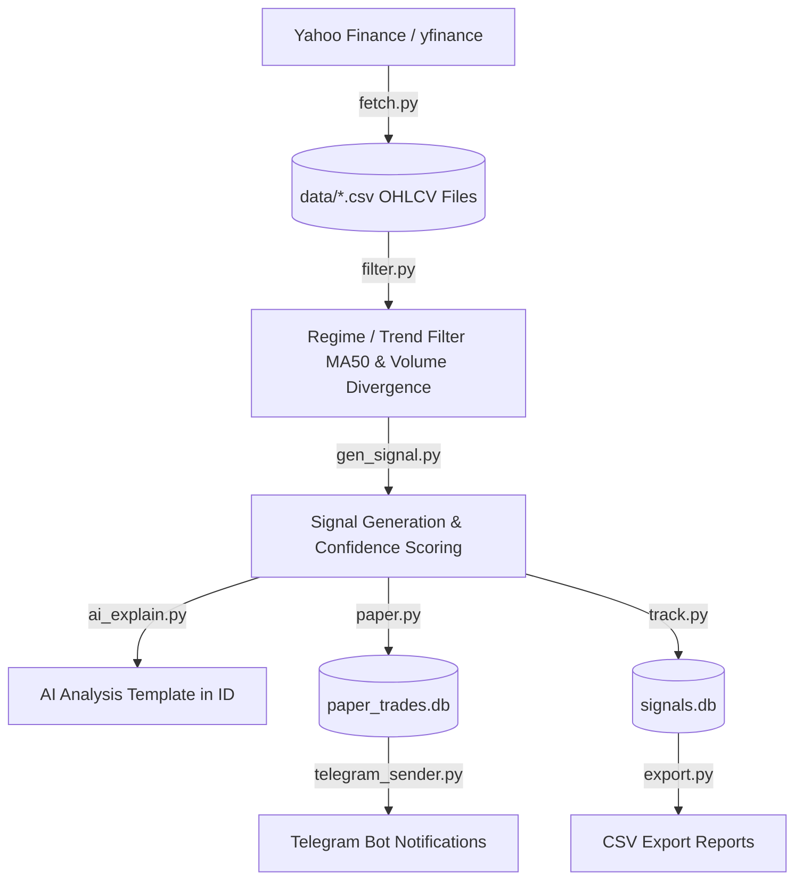

# IDX Stock Signal Research System — Project Analysis & Study

> **Document Created:** July 24, 2026  
> **Repository Location:** `/Users/cahyo/Developer/Web/stock signal`  
> **Status:** Operational / Paper Trading Phase (T6_TREND_FILTERED)

---

## 1. Executive Summary

The **IDX Stock Signal Research System** is an automated quantitative research and paper trading pipeline built specifically for the **Indonesian Stock Exchange (IDX)**. Its primary objective is to detect **volume divergence** patterns (indicating smart money accumulation/distribution), filter out low-probability trades using market regime and trend indicators, and execute a disciplined 6-month paper trading experiment.

### Key Objectives
- **Volume Divergence Detection**: Identify accumulation across liquid Indonesian equities.
- **Rule-Based Filtering**: Filter trades using trend confirmation (50-day Moving Average) and volume ratio metrics.
- **Paper Trading Engine**: Simulate realistic trade performance (slippage, broker fees, stamp duty) with zero automated real-money risk.
- **Automated Alerts & AI Explanations**: Send daily signal and paper trade notifications to Telegram in Bahasa Indonesia using rule-based explainability templates.

---

## 2. System Architecture & Data Flow



### Module Blueprint

| Module / File | Primary Responsibility |
|---|---|
| [`settings.py`](file:///Users/cahyo/Developer/Web/stock%20signal/settings.py) | **Single Source of Truth**. Contains all universe definitions, strategy parameters (MA50, ATR stop multiplier, max hold days, fees), and database file paths. |
| [`run.py`](file:///Users/cahyo/Developer/Web/stock%20signal/run.py) | **CLI Entry Point**. Orchestrates 14 user commands (`fetch`, `paper`, `paper-status`, `daily`, `health`, `export`, etc.). |
| [`fetch.py`](file:///Users/cahyo/Developer/Web/stock%20signal/fetch.py) | Downloads daily OHLCV historical price data from Yahoo Finance (`.JK` tickers) into `data/<TICKER>.csv`. Includes retries and backoff. |
| [`filter.py`](file:///Users/cahyo/Developer/Web/stock%20signal/filter.py) | Implements market regime classification (Bull/Bear/Sideways), liquidity thresholds (Min close IDR 500, Min 20d ADV IDR 5B), and volume divergence scoring (0–100). |
| [`gen_signal.py`](file:///Users/cahyo/Developer/Web/stock%20signal/gen_signal.py) | Scans datasets for signal entries, entry boundaries, stop-loss levels, and confidence calculations. |
| [`paper.py`](file:///Users/cahyo/Developer/Web/stock%20signal/paper.py) | **Paper Trading Portfolio Engine**. Manages open paper positions, monitors exit triggers (Stop Loss hit or Max 20-day holding period expired), updates P&L, Win Rate, and Drawdowns in `paper_trades.db`. |
| [`research.py`](file:///Users/cahyo/Developer/Web/stock%20signal/research.py) | Multi-strategy historical backtest engine (analyzed 893+ historical trades across 4 strategy variations). |
| [`ai_explain.py`](file:///Users/cahyo/Developer/Web/stock%20signal/ai_explain.py) | Template-based natural language generator producing signal summaries in Bahasa Indonesia without needing LLM APIs. |
| [`telegram_sender.py`](file:///Users/cahyo/Developer/Web/stock%20signal/telegram_sender.py) | Formats and transmits signal alerts, paper exit logs, weekly performance summaries, and health notifications to Telegram. |
| [`monitor.py`](file:///Users/cahyo/Developer/Web/stock%20signal/monitor.py) | Automated system health checker executing 10 diagnostic checks (data freshness, DB integrity, disk space, duplicate logic, API health). |
| [`export.py`](file:///Users/cahyo/Developer/Web/stock%20signal/export.py) | CSV exporter exporting database tables to spreadsheet-ready reports in `exports/`. |

---

## 3. Quantitative Strategy Specification (`T6_TREND_FILTERED`)

The system currently— **Primary Strategy**: **T6_TREND_FILTERED** (Volume divergence + 50-day Moving Average trend filter on the **IDX200** expanded universe of 179+ liquid stocks).
- **Stock Universe**: `idx200` (179+ liquid constituents on IDX).
- **Trend Filter**: Stock price must be strictly **above its 50-day Moving Average (MA50)**.
- **Volume Filter**: Volume Ratio $\ge 2.0$ (volume spike accompanying the divergence).
- **Direction**: **Long-Only** (BUY signals only; short/sell signals filtered out for retail suitability).
- **Risk & Position Management**:
  - **Stop Loss**: $3.0 \times \text{ATR}$ below entry price.
  - **Take Profit**: None (lets winning trades run).
  - **Max Holding Period**: 20 trading days (`T6_MAX_HOLD_DAYS = 20`).
  - **Max Portfolio Size**: 10 simultaneous open positions (`T6_MAX_POSITIONS = 10`).
  - **Starting Capital**: IDR 100,000,000.
  - **Realistic Transaction Costs**: ~0.6% round trip (Slippage 0.15%, Broker Fee 0.35%, Stamp Duty 0.10%).

---

## 4. Current System & Environment State

- **Environment**: Virtual environment `.venv/` is fully configured with required packages (`pandas`, `numpy`, `yfinance`, `python-dotenv`, `requests`).
- **Data Status**: Price data for key large-caps (`BBCA`, `BBRI`, `BMRI`, `BBNI`, `TLKM`, `ASII`, `ADRO`, `ICBP`, `INDF`, `UNVR`, `GGRM`, `HMSP`, `KLBF`, `SMGR`, `PGAS`) updated to current date.
- **Databases**:
  - `signals.db`: Primary database for historical signal tracking.
  - `paper_trades.db`: Dedicated database for Strategy T6 paper trading portfolio (currently fresh with 0 open / 0 closed trades).

---

## 5. Daily Operation & SOP Guide

### Standard Daily Workflow
```bash
# 1. Navigate to directory and activate environment
cd ~/Developer/Web/stock\ signal
source .venv/bin/activate

# 2. Download latest market prices
python run.py fetch

# 3. Execute paper trading cycle (checks exits & scans new entries)
python run.py paper

# 4. Check paper portfolio performance & open positions
python run.py paper-status

# 5. Run health diagnostics
python run.py health
```

---

## 6. CLI Command Reference

| Command | Purpose |
|---|---|
| `python run.py fetch` | Download latest daily OHLCV prices from Yahoo Finance for configured universe |
| `python run.py paper` | Execute T6 paper trading cycle (process exits & open new positions) |
| `python run.py paper-status` | Display paper portfolio metrics (Win Rate, Profit Factor, Open Positions) |
| `python run.py daily` | Full production daily cycle: fetch data → generate signals → send Telegram |
| `python run.py daily --paper` | Full daily cycle + T6 paper tracking combined |
| `python run.py signal` | Generate signals and output to terminal (no DB save, no Telegram) |
| `python run.py weekly` | Generate and send weekly T6 performance report to Telegram |
| `python run.py health` | Run 10 system health checks and report status |
| `python run.py export` | Export SQLite database contents to CSV files in `exports/` |
| `python run.py test` | Send a test ping to Telegram to verify credentials |
| `python run.py research` | Run historical backtest & strategy ranking |
| `python run.py open` | List all open signals pending trade resolution |

---

## 7. Recommended Next Steps for Resuming

1. **Verify Credentials**: Run `python run.py test` to confirm Telegram notifications are working.
2. **Refresh All Ticker Data**: Run `python run.py fetch` to pull the latest daily data for all IDX80 stocks.
3. **Initiate Daily Observation**: Run `python run.py paper` daily after market close (~16:00 - 17:30 WIB).
4. **Deploy Automation (Optional)**: If deploying to a server/VPS, refer to `VPS_DEPLOYMENT.md` and use `scripts/deploy_vps.sh` for cron setup.
